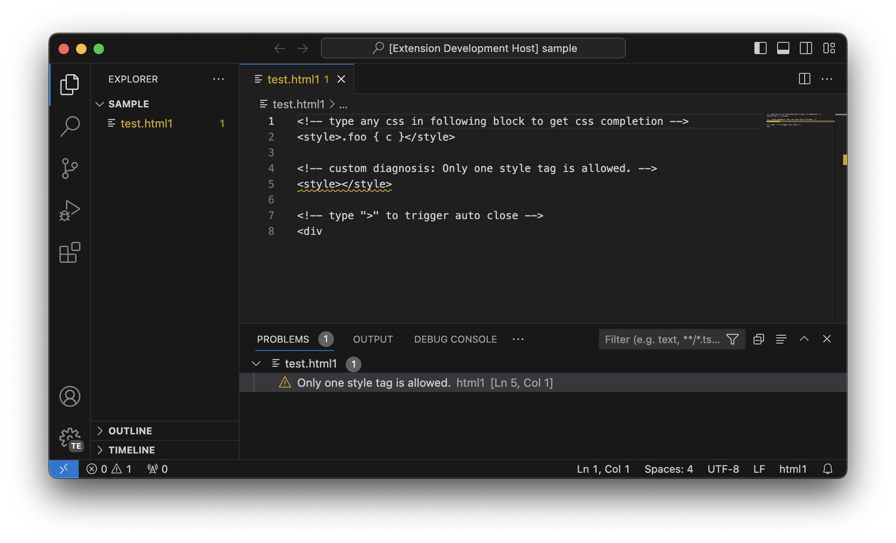
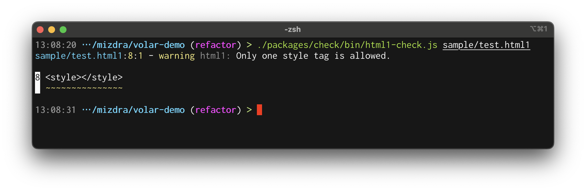

# volar-demo

## What's this?

This is Volar.js demo project for Vue Fes Japan 2023. Volar.js is Embedded Language Tools Framework.

It is based on https://github.com/volarjs/starter but with some modifications.

## Project Structure

- `packages/language-server`: The language server for `.html1`
- `packages/vscode`: VSCode extension for `.html1`
  - This wraps `packages/language-server` and provides language features to VS Code.
  - See "Running the language server" section for more information.
- `packages/check`: The checker for `.html1`
  - This is a standalone checker for `.html1`.
  - It can be used in Terminal or CI.
  - See "Usage" section for more information.
- `packages/core`: The core modules of `.html1`
  - This is the core module referenced by `packages/language-server` and `package/check`.

## Running the language server

- Run `pnpm install` in this folder. This installs all necessary npm modules in both the client and server folder
- Open VS Code on this folder.
- Press Ctrl+Shift+B (Command+Shift+B on Mac) to compile the client and server.
- Switch to the Debug viewlet.
- Select `Launch Client` from the drop down.
- Run the launch config.
- If you want to debug the server as well use the launch configuration `Attach to Server`
- In the [Extension Development Host] instance of VSCode, open a `test.html1`
  - Type `<d|` to try HTML completion
  - Type `` to try CSS completion
  - Have `` to see CSS Diagnostics

## Running the checker

- Run `pnpm install` in this folder. This installs all necessary npm modules in both the client and server folder
- Open VS Code on this folder.
- Press Ctrl+Shift+B (Command+Shift+B on Mac) to compile the client and server.
- Run `./packages/check/bin/html1-check.js sample/test.html1` in this folder.

## Build .vsix

- Run `pnpm run pack` in this folder
- `packages/vscode/vscode-html1-0.0.1.vsix` will be created, and you can manual install it to VSCode.

## References

- https://code.visualstudio.com/api/language-extensions/embedded-languages
- https://github.com/microsoft/vscode-extension-samples/tree/main/lsp-embedded-language-service
